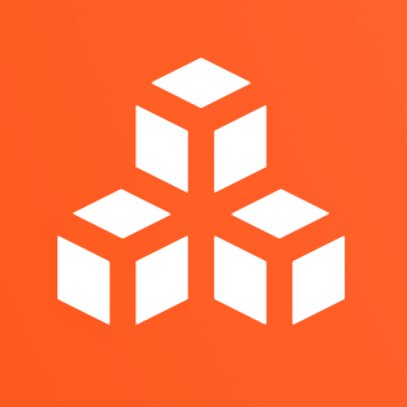

 

## 👋 About Me

I'm a software engineer who likes building things end to end, from the backend and data all the way to the web app people actually use.

Most of my work is in Next.js, TypeScript, Prisma and Flask, and I deploy with Docker, AWS and Vercel. So far I've shipped a couple of SaaS platforms, an ML-powered churn prediction service, and a blockchain app that won gold at Hackmos 2024.

I also did research in applied machine learning for healthcare during my degree, including a digital-twin platform for predicting gestational diabetes. There's more on that further down if you're curious.

- 🎓 B.Sc. in Computer Science from the University of Sharjah, 3.90 GPA with Highest Honors. Recognized for academic excellence, [Spring 2024/2025](https://drive.google.com/drive/folders/1e6Nin0r-KESiuB_1LfLaxkwbTJ6op_E0?usp=drive_link)
- 💬 Happy to talk about full-stack SaaS, building and deploying ML APIs, or AI Engineering.

## 💼 What I'm Working On

> Software Engineer · **BK Consultancy and Training** · May 2026 to Present

-  [Coursebricks](https://coursebricks.io/): The company's training-management platform. I work with the Coursebricks team to ship new features and improve the existing codebase.
-  [Maturix](http://maturix.app): A new maturity-assessment platform that I'm helping build from the ground up.

## 🛠️ Tech Stack

**Languages**

**Frontend**

**Backend & Databases**

**Machine Learning & AI**

**DevOps & Cloud**

## 📌 Featured Projects

## 🚀 Projects

| Project | What it is | Tech | Links |
|---|---|---|---|
| GlucoTwin | A digital-twin web app for early prediction of gestational diabetes. It reaches 90% recall with XGBoost and shows the results on a clinical dashboard. | Next.js, Flask, XGBoost, Prisma | [Repo](https://github.com/abdulla-sayed/GlucoTwin), [Live](https://gluco-twin.vercel.app/) |
| ChurnPredict AI | A telecom churn-prediction service. A Dockerized Flask API on Render with a Next.js frontend for real-time predictions. | scikit-learn, Flask, Docker, Next.js | [Repo](https://github.com/abdulla-sayed/churn_prediction), [Live](https://churn-prediction-ochre.vercel.app/) |
| E-commerce SaaS (Store) | The customer-facing storefront for a multi-tenant e-commerce platform. | Next.js, TypeScript, Prisma | [Repo](https://github.com/abdulla-sayed/E_commerce_SAAS_store) |
| E-commerce SaaS (Admin) | The admin dashboard for the same platform, covering catalog, orders and analytics. | Next.js, TypeScript, Prisma | [Repo](https://github.com/abdulla-sayed/E_commerce_SAAS_admin) |
| SHAP Implementation | An explainable-AI pipeline that pairs SHAP with optimisation heuristics (PSO, GA, ACO) for biomarker interpretability. | Python, SHAP, scikit-learn | [Repo](https://github.com/abdulla-sayed/SHAP_implementation) |

## 📚 Publications & Research

> Research Assistant (Part-time) · **OpenUAE Research & Development Group, University of Sharjah** · Aug 2023 to Dec 2025

| Publication | Venue / status | Role | Link |
|---|---|---|---|
| GlucoTwin: A Machine Learning-Based Digital Twin System for Early Prediction of Gestational Diabetes | Springer EHB 2025 | First author | [Paper](https://drive.google.com/drive/folders/1MdvTTtZOAHdgtelL-PX1awhvH5Okumn6?usp=drive_link) |
| GlucoTwin: A Digital Twin Platform for Real-Time Monitoring and Early Intervention in Gestational Diabetes | EDEC 2026, accepted for oral presentation (Feb 2026) | First-presenting author | [Paper](https://drive.google.com/drive/folders/1ZD32NKu6jJHP1o94viNa0b9N8qCIKpF6?usp=drive_link) |
| Semi-Supervised Learning-Based Genetic Biomarkers Dataset for Multiple-Stage Hepatocellular Carcinoma Prediction | DeSE 2025 | Co-author | [Paper](https://drive.google.com/drive/folders/1ugygoLs2AsqcnQBoxJCoBCeHmA1iUxIR?usp=drive_link) |
| Potential of Artificial Intelligence Algorithms for Identification of Relevant Diagnostic and Prognostic Biomarkers of Early-Stage Liver Cancer | Journal, under review (Biomedical Signal Processing and Control) | Co-author | [Paper](https://drive.google.com/drive/folders/10RPk31LWchlzvFdGbCFbY3QW2DiGa6Ss?usp=drive_link) |

## 🏆 Achievements

- Won gold at Hackmos 2024 for a blockchain-powered app.
- Co-authored four research papers as an undergraduate, all in applied machine learning for healthcare, appearing in venues like Springer EHB 2025, EDEC 2026 and DeSE 2025. Getting that much published before graduating is something I'm genuinely proud of.
- The journal paper on early-stage liver cancer biomarkers is a collaboration with a medical research team at the University of Lübeck in Germany. We held a number of joint meetings and working sessions over the course of the project, and it's currently under review at Biomedical Signal Processing and Control.
- Interned as an AI Engineer at Saal.AI in Abu Dhabi (May to July 2025), where I built ChurnPredict AI, earned a perfect 60/60 mentor score, and got hands-on experience with vLLM and LLM chatbot prototyping.
- Graduated with a 3.90/4.00 GPA (Highest Honors) and made the Dean's List.

## 📊 GitHub Stats

 

### 🐍 Contribution Activity

## 🤝 Connect with me!

